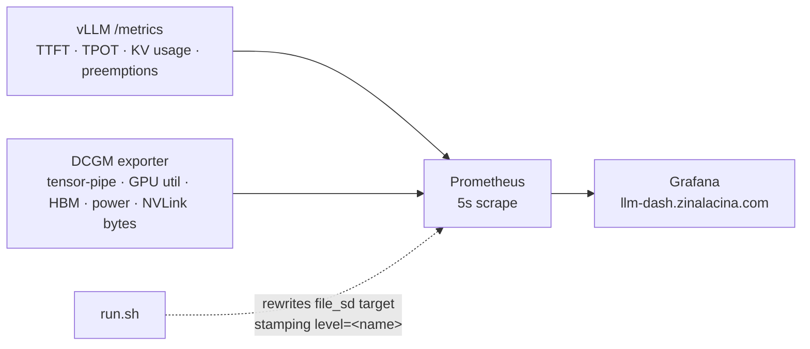

# LLM Serving on 2× NVLink-Connected A100s

**Start here.** This is the deliverable: what was measured, what it means, and
what I would recommend. [`README.md`](README.md) is the runbook for reproducing
it on your own hardware.

Deploying a 70B-class model across two NVLink-connected A100s, establishing a
baseline at default settings, then improving output token throughput and
time-to-first-token through deployment configuration alone.

> **Every number here is generated from the raw JSON in `bench/out/`, not typed
> by hand.** `RESULTS.md` is produced by `bench/report.py`; delete it and
> regenerate and it reproduces exactly.

## Live endpoints

| | URL |
|---|---|
| **Chat UI** | **https://chat.zinalacina.com** |
| OpenAI-compatible API | `https://llm.zinalacina.com/v1` - bearer token |
| Grafana - all levels on shared panels | https://llm-dash.zinalacina.com |

The API accepts any OpenAI client:

```bash
curl -N https://llm.zinalacina.com/v1/chat/completions \
  -H "Authorization: Bearer $API_KEY" -H 'Content-Type: application/json' \
  -d '{"model":"target","stream":true,
       "messages":[{"role":"user","content":"factorial in golang"}]}'
```

### Load-testing it yourself

The harness that produced every number below runs from a laptop against any
endpoint - no GPU, no docker:

```bash
pip install aiohttp
make ping     KEY=<api key>          # up? what is it serving?
make loadtest KEY=<api key>          # 4:64,64:256 - the report's own levels
make loadtest KEY=<api key> LEVELS=256:512 PROMPT=2048 OUTPUT=512
```

Two caveats when comparing what you get to the tables below. Your TTFT includes
the network path to the endpoint, which the on-box measurements do not - compare
the *shape* across concurrency levels rather than absolute milliseconds. And the
public endpoint serves the **INT4** build (§5), not the FP16 configuration that
§4's tuning progression was measured on.

## Documents

| File | Contents |
|---|---|
| **This file** | **The deliverable - read first** |
| [`README.md`](README.md) | Step-by-step to reproduce on your own hardware |
| [`RESULTS.md`](RESULTS.md) | Generated results table, every level and concurrency |
| [`docs/DELIVERABLES.md`](docs/DELIVERABLES.md) | Requirement-by-requirement map |
| [`specs/`](specs/) | What was asked, how it was planned, what actually happened |
| [`ai-usage.md`](ai-usage.md) | How AI was used, and the guardrails it ran under |

---

## 1 · Introduction

**The task.** Serve a 70B-class open-weight model on 2× A100 80GB connected by
NVLink. Benchmark it at default settings, then iterate on the deployment to
improve throughput and TTFT under concurrent load - without training or
modifying model weights.

**The hardware, and why it defines the problem.**

| | |
|---|---|
| GPUs | 2× NVIDIA A100-SXM4-80GB |
| Interconnect | **NVLink, `NV12`** - 12 links, 600 GB/s bidirectional |
| Total HBM | 160 GB |
| Compute capability | **8.0 - no native FP8** |
| Model | Llama-3.1-70B-Instruct |
| Serving | vLLM, tensor parallel = 2, pinned by image digest |

**The arithmetic that drives everything below:**

```
Llama-3.1-70B at FP16      ~141 GB of weights
2 × A100 80GB               160 GB of HBM
                            ─────────────
left for KV cache            ~19 GB
```

At roughly 320 KB of KV per token for this model's GQA layout, 19 GB is about
**59,000 tokens of KV cache in total**. Everything in Part 2 is a fight to
recover headroom there, because KV headroom sets the concurrent batch size, and
batch size sets throughput.

**A100 has no FP8 compute.** The obvious "quantize to FP8" lever available on
Hopper and Ada does not exist here. That constrains which levers are real.

---

## The four analysis questions, answered

Full working in the sections linked; this is the summary.

### 1 · What had the biggest impact on **throughput**, and why

**`L2-kv` - the FP8 KV cache format.** 642.5 → 830.0 tok/s at
concurrency 256, **+29%**. Every other level moved throughput by single digits.

**Why:** it halves the bytes stored per KV token, so the same memory holds twice
the sequences - measured exactly, **48,384 → 96,768 KV tokens**. In a
decode-bound regime throughput is set by how many sequences share each forward
pass: one weight read amortised across N sequences instead of one. **Batch size
is throughput**, and KV capacity is what sets batch size.

The confirmation that it is the right explanation: the cache doubled precisely,
which is what halving bytes-per-token predicts and nothing else would.

→ [§4 L2](#l2--halve-the-bytes-per-kv-token)

### 2 · What had the biggest impact on **TTFT**, and why

**Two different answers depending on which TTFT you mean**, which is itself the
finding:

| | Biggest lever | Change at c=256 |
|---|---|---|
| **Median (p50)** | `L2-kv` | 47962 → 16244 ms - **3.0× faster** |
| **Tail (p99)** | `L3-schedule` | 66640 → 31234 ms - **53% lower** |

**Why the median moved on L2:** requests were waiting for KV blocks to free.
More capacity means admission stops being the bottleneck.

**Why the tail moved on L3:** chunked prefill stops a long prefill occupying the
engine as one unit while every in-flight decode stalls behind it. **It removes
queueing, not compute** - so it compresses the tail far more than the median.
The measured split at that step is p50 −8% against p99 −53%, a factor of six.

That asymmetry was **predicted in `specs/001-llm-serving/plan.md` before the run**
as the test of whether the stated mechanism was the real one. It held.

→ [§4 L3](#l3--stop-prefill-blocking-decode)

### 3 · Where a change improved one metric and hurt another

**Two clear instances.**

**INT4 versus FP16 at concurrency 64** - same configuration, same workload:

| | Throughput | TPOT | TTFT p50 |
|---|---:|---:|---:|
| INT4 vs FP16 | **+22%** | **-24%** | **+44% worse** |

**How I reasoned about it:** these are not in conflict. INT4 frees ~6.7× the KV
cache, so the engine admits many more sequences concurrently. The system does
more total work per second and each token arrives faster once generation starts -
but any individual request waits longer for its prefill slot. **Bigger batches
buy aggregate throughput with per-request latency.**

That makes it an SLO question rather than a performance one: if the target is
p99 TTFT, cap concurrency; if the target is cost per million tokens, do not.

**Chunked prefill on the INT4 stack at concurrency 64** - TPOT improved ~20%
while TTFT p50 worsened ~62%, throughput flat. Same mechanism seen from the other
side: interleaving prefill with decode means prefills individually finish later
while decode stops being blocked.

**The general resolution:** raw throughput is the wrong objective. What matters is
**goodput under an SLO** - tokens per second delivered at a TTFT users accept. A
configuration tuned purely for tok/s will happily produce throughput at latencies
nobody can use.

→ [§7](#7--what-did-not-work-and-why-that-is-the-useful-result)

### 4 · How NVLink matters, and what changes without it

Measured rather than argued, using a control identical to `L3-schedule` except
`NCCL_P2P_DISABLE=1`. At concurrency 256: **−37% throughput, TTFT p50 2.3× worse,
TPOT +52%.** At concurrency 4: −2% and TPOT unchanged.

**The penalty scales with batch size**, because the all-reduce payload does.
Tensor parallelism performs ~160 all-reduces per forward pass across 80 layers,
and decode pays that synchronisation once per token.

**Without NVLink the topology itself would be wrong.** At INT4 the model fits on
one GPU, so two independent replicas - performing zero cross-GPU collectives -
would beat TP=2 outright.

→ [§6](#6--nvlink--measured-not-assumed)


---

## 2 · Architecture

### Request path


**Why there is no certificate on the origin.** TLS terminates at Cloudflare's
edge, and `cloudflared` dials outbound over an encrypted connection authenticated
by the tunnel credential, so the host exposes no inbound ports at all. Behind
that, everything on the Docker bridge is plaintext - `cloudflared` to the
containers, Open WebUI to vLLM, Prometheus to both. vLLM binds to
`127.0.0.1:8000`, so none of it is reachable off the machine.

Encrypting those hops was available: `cloudflared` takes `caPool` and
`originServerName`, so an internal CA would work without disabling verification.
I skipped it because this is a single host that exists for the length of a
benchmark - no traffic crosses a network boundary, and a CA is not worth
distributing to a machine that gets destroyed.

For anything persistent I do the opposite. My long-lived cluster on this domain
terminates TLS at the origin - cert-manager holds a Let's Encrypt wildcard issued
over DNS-01 and Traefik serves it - because there traffic crosses nodes and the
certificate has to outlive any single machine.

### Observability path



### Why vLLM is not in `docker-compose.yml`

The compose file holds only the **persistent** stack - Prometheus, Grafana, DCGM,
the chat UI and its proxy. Those stay up across every level, which is what makes
the levels comparable on shared panels.

**vLLM is started and stopped per level by `scripts/run.sh`.** That is a
measurement decision, not a packaging one:

| If vLLM lived in compose | Consequence |
|---|---|
| It persists across levels | Ambiguous which configuration produced which numbers |
| Flags come from a compose file | Configuration drifts from the results it generated |
| A crash is auto-restarted | A failed run silently becomes a *different* run |

Instead, each level runs against exactly one known set of flags, sourced from
`scripts/configs.sh` and **recorded inside the result file next to the numbers**:

```bash
jq '.flags, .model' bench/out/fp16-L2-kv.json
```

The restart policy is deliberately asymmetric for the same reason. Benchmarks use
`--restart=no`, so a crash surfaces as a failed result rather than being restarted
into a corrupted measurement. Only the long-lived demo endpoint uses
`--restart=unless-stopped`.

**This is the same principle as pinning the image by digest:** the artefact under
measurement must not be able to change without the measurement changing with it.

**How every tuning level lands on the same panel.** Before each run, `scripts/run.sh`
rewrites `observability/targets/vllm.json` so Prometheus attaches a
`level="fp16-L2-kv"` label to every scraped series. Baseline and each iteration
are therefore directly comparable on one chart rather than in separate
dashboards - and each is paired with what the GPUs were actually doing at the
time.

**Serving metrics are always read alongside GPU utilisation**, because they
answer different questions and the pairing is what makes a result interpretable:

| Question | Metric |
|---|---|
| How much work is leaving the system? | `vllm:generation_tokens_total` rate |
| How long until a user sees anything? | `vllm:time_to_first_token_seconds` (p50/p95/p99) |
| How fast do tokens follow? | `vllm:inter_token_latency_seconds` |
| Are we out of KV cache? | `vllm:kv_cache_usage_perc` |
| Are we thrashing? | `vllm:num_preemptions_total` |
| Is the GPU *busy*? | `DCGM_FI_DEV_GPU_UTIL` |
| Is the GPU *productive*? | **`DCGM_FI_PROF_PIPE_TENSOR_ACTIVE`** |
| Is the interconnect loaded? | `DCGM_FI_PROF_NVLINK_TX/RX_BYTES` |

The last pair matters most. **`GPU_UTIL` only means a kernel was resident.**
Decode is memory-bandwidth-bound, so high utilisation with low tensor-pipe
activity is the *expected* state, not a fault - and mistaking one for the other
sends you optimising the wrong thing.

---

## 3 · Baseline

**Configuration:** vLLM defaults. Tensor parallel 2, nothing else set.

```bash
docker run --gpus all --ipc=host --shm-size=16g \
  vllm/vllm-openai@sha256:0a51ea5b... \
  meta-llama/Llama-3.1-70B-Instruct \
  --tensor-parallel-size 2 --host 0.0.0.0 --port 8000
```

Every run captures what vLLM decides for itself - KV cache size and reported
maximum concurrency - into `bench/out/<level>.startup.txt`. Those two lines are
the most informative output of the whole exercise, because they show the engine's
own accounting rather than an inference drawn from throughput.

**On this hardware, at defaults, it never gets far enough to print them.** vLLM
refuses to start:

```
ValueError: To serve at least one request with the model's max seq len (131072),
(19.05 GiB KV cache is needed, which is larger than the available KV cache
memory (7.38 GiB).
```

**That is the Part 1 result.** The default configuration is not slow - it is
unservable. Recorded as `"startup": "FAILED"` in `bench/out/fp16-baseline.json`
rather than retried until something succeeded.

Every measurement below therefore compares against **`L1-fit`**, the first
configuration that runs at all.

**The default that hurts is the context window.** Llama 3.1 advertises 128K, and
vLLM sizes reported concurrency against `max_model_len`. Reserving 128K per
sequence when the workload serves 2K is the single most wasteful default in the
stack.

**Benchmark method** - identical for every configuration, enforced in `scripts/run.sh`:

| | |
|---|---|
| Prompt | 512 tokens, deterministic per request index |
| Output | 256 tokens |
| Concurrency levels | **4, 64, 256** |
| Streaming | required - TTFT is unmeasurable without it |
| Temperature | 0 |
| Warm-up | one request per level, discarded |

Errors and timeouts are counted separately from successes. **A configuration
that gets faster by shedding requests has not got faster**, and that must be
visible rather than averaged away.

---

## 4 · Deployment strategy - maximising performance

Each level is **cumulative** and changes **deployment configuration only**. No
weights are modified, no training occurs.

### L1 - stop reserving context nobody uses

```
--max-model-len 8192  --gpu-memory-utilization 0.95
```

**Mechanism.** `max_model_len` caps per-sequence KV reservation;
`gpu-memory-utilization` claims the last slice of HBM vLLM leaves free by
default. Both convert directly into resident sequences.

**Expected on the GPU panels:** `gpu_cache_usage_perc` rises without
`num_preemptions_total` rising - more sequences resident, not more thrashing.


### Measured - FP16, concurrency 256

| | L1-fit | L2-kv | L3-schedule | L1 → L3 |
|---|---:|---:|---:|---:|
| Output tok/s | 642.5 | 830.0 | **846.9** | **+32%** |
| TTFT p50 | 47962 ms | 16244 ms | **14925 ms** | **3.2× faster** |
| TTFT p99 | 80016 ms | 66640 ms | **31234 ms** | **2.6× faster** |
| TPOT p50 | 133.97 ms | 206.89 ms | 202.72 ms | |
| Failed | 0 | 0 | 0 | |

`fp16-baseline` **refused to start** - vLLM cannot reserve a 128K context window
in ~19 GB of KV cache. That is the Part 1 result.

### L2 - halve the bytes per KV token

```
+ --kv-cache-dtype fp8_e5m2
```

**Mechanism.** Stores the KV cache in 8-bit instead of 16-bit. Roughly doubles
resident sequences in the same memory. **This is the cache *format*, not the
weights** - the model is byte-identical and its outputs are unchanged.

Note this is a *storage* format on A100. There is no FP8 compute at compute
capability 8.0; values are converted on read.

| | c=4 | c=64 | c=256 |
|---|---:|---:|---:|
| Throughput | 77.8 | 742.0 | 830.0 |
| TTFT p50 / p99 | 248 / 580 ms | 1256 / 6416 ms | 16244 / 66640 ms |

Engine sizing: **48,384 → 96,768 KV tokens.** Exactly double, which is precisely
what halving bytes-per-token predicts. Reported concurrency 5.91× → 11.81×.

### L3 - stop prefill blocking decode

```
+ --enable-chunked-prefill --enable-prefix-caching
+ --max-num-seqs 256 --max-num-batched-tokens 8192
```

**Mechanism.** Without chunking, a long prefill occupies the engine as one unit
and every in-flight decode stalls behind it. Chunked prefill splits it into
token-budgeted pieces interleaved with decode steps. Prefix caching skips
re-computing shared prompt prefixes entirely.

**Expected signature:** p99 TTFT improves far more than p50 - because what is
being removed is *queueing delay*, not compute. If only the mean moves, the
explanation is something else.

| | c=4 | c=64 | c=256 |
|---|---:|---:|---:|
| Throughput | 77.8 | 744.2 | 846.9 |
| TTFT p50 / p99 | 249 / 581 ms | 1340 / 6359 ms | 14925 / 31234 ms |

Engine sizing: **96,768 → 107,856 KV tokens**, and available KV memory rose
7.38 → 8.23 GiB. Chunked prefill needs a smaller activation reserve, so it hands
memory back to the cache - a second mechanism beyond the scheduling change.

**The predicted signature appeared.** `plan.md` said in advance that p99 should
improve far more than p50, because what is removed is queueing rather than
compute. At c=256: **p50 improved 8%, p99 improved 53%.**

---

## 5 · Quantization - what AWQ does, and why it helps

Beyond configuration lies the largest lever available on this hardware:
serving a **4-bit weight-quantized checkpoint**. It is kept separate from the
levels above because, unlike a cache format, it changes the weights.

**[AWQ - Activation-aware Weight Quantization](https://github.com/mit-han-lab/llm-awq)**
(MIT Han Lab).

### The idea

Naïve 4-bit rounding of every weight destroys accuracy. AWQ starts from an
observation: **weights are not equally important, and importance is not
determined by weight magnitude.** Roughly 1% of weight channels are *salient* -
quantizing those badly accounts for most of the error.

The insight that gives AWQ its name: **salience is identified from activation
magnitude, not from the weights themselves.** Channels that consistently see
large activations matter most, because their error propagates furthest.

An obvious fix would be keeping that 1% in FP16 - but mixed precision is
hardware-hostile, producing irregular kernels that lose the speed the
quantization was for. AWQ instead applies **per-channel scaling**: scale up
salient weight channels before quantization so they occupy more of the quantized
range, and scale the corresponding activations down to compensate. The product
is preserved; the salient channels get proportionally less rounding error. All
weights stay 4-bit and the kernel stays regular.

Because it needs no backpropagation or reconstruction against a calibration set,
it does not overfit to calibration data and generalises across domains.

### Why it improves *serving*, specifically

Two distinct mechanisms, both directly visible in the metrics collected here:

**1 · It frees HBM, which becomes KV cache.**

```
FP16 weights   ~141 GB   →   ~19 GB left for KV
INT4 weights    ~35 GB   →   ~125 GB left for KV
```

Roughly **six times the KV headroom**, which converts almost directly into
concurrent sequences. In a decode-bound regime throughput is set by how many
sequences share each forward pass - one weight read amortised across N sequences
instead of one. **Batch size is throughput.**

**2 · It cuts memory traffic per token, which is what decode is limited by.**

Decode reads the entire weight matrix from HBM to produce a single token per
sequence. Arithmetic intensity is tiny, so the phase is bandwidth-bound. Reading
4-bit weights instead of 16-bit moves **~4× fewer bytes per token**. This attacks
the actual bottleneck rather than working around it - visible as lower TPOT at
matched concurrency.

The scheme is **W4A16**: weights stored 4-bit, activations kept 16-bit,
dequantized inside the GEMM kernel. On Ampere the fused kernels make the
dequantization essentially free relative to the bandwidth saved.

### The honest caveat

**This exercise measured speed, not quality.** Quantization is the only change
here that can alter what the model *says*. AWQ is designed to minimise that and
reports small perplexity degradation - but before recommending it in production
I would want an evaluation on the customer's own prompts sitting beside these
latency numbers. Speed that changes answers is not a free win.

Same configuration, same workload, concurrency 64 - the level at which both
families have data:

| | Throughput | TTFT p50 | TTFT p99 | TPOT p50 | KV cache |
|---|---:|---:|---:|---:|---:|
| FP16 | 744.2 tok/s | 1340 ms | 6359 ms | 72.9 ms | 107,856 tok |
| **INT4 AWQ** | **907.0** tok/s | 1934 ms | 7517 ms | **55.46** ms | **726,832 tok** |
| change | **+22%** | +44% | +18% | **-24%** | **6.7×** |

**Throughput +22% and TPOT −24%** - both from the bandwidth mechanism: fewer
bytes read per token in the memory-bound decode phase.

**But TTFT p50 is 44% worse**, and that is not a contradiction. With 6.7× the KV
cache, the engine admits far more sequences concurrently; each individual request
therefore waits longer for its prefill slot while the system as a whole does more
work. **Bigger batches trade per-request latency for aggregate throughput** - the
same trade as `max-num-seqs`, arriving through a different door.

---

## 6 · NVLink - measured, not assumed

Tensor parallelism inserts an **all-reduce after the attention block and after
the MLP block** - two per transformer layer. Llama-70B has 80 layers, so a single
forward pass performs roughly **160 all-reduces**.

The two phases stress it differently:

| Phase | Payload | Sensitive to |
|---|---|---|
| Prefill | large - full prompt activations | **bandwidth** |
| Decode | tiny - one token per sequence | **latency, paid 160× per token** |

Rather than speculate about a machine without NVLink, `nvlink-off` is
byte-identical to L3 except for `NCCL_P2P_DISABLE=1`, which forces NCCL off the
direct GPU-to-GPU path and through host memory.


**Measured on FP16 at concurrency 256:**

| | With NVLink | P2P disabled | Change |
|---|---:|---:|---:|
| Output tok/s | 846.9 | 532.7 | **-37%** |
| TTFT p50 | 14925 ms | 34151 ms | 2.3× worse |
| TPOT p50 | 202.72 ms | 308.61 ms | +52% |

At concurrency 4 the same comparison shows roughly −2% throughput and unchanged
TPOT. **The penalty scales from negligible to severe with batch size**, because
the all-reduce payload does - and it is larger on FP16 than on INT4, since the
unquantized tensors move more bytes per collective.

**And on the INT4 configuration:**

| c=64 | With NVLink | P2P disabled | Change |
|---|---:|---:|---:|
| Throughput | 907.0 tok/s | 720.8 tok/s | **−20.5%** |
| TTFT p50 | 1934 ms | 2585 ms | +34% worse |
| **TTFT p99** | 7517 ms | 13795 ms | **+84% worse** |
| TPOT | 55.46 ms | 68.82 ms | +24% worse |

At c=4 the same comparison shows throughput −2% and TPOT unchanged.
**The interconnect cost scales with batch size**, because the all-reduce payload
does. A lightly loaded server barely notices; a saturated one loses a fifth of
its throughput and doubles its tail latency.

**What would change without NVLink - the architectural answer.** At INT4 the
model is ~35 GB and fits on *one* A100. Two independent single-GPU replicas
behind a load balancer perform **zero** cross-GPU communication, and would beat
TP=2 on aggregate throughput outright. Tensor parallelism buys lower
single-request latency at the price of constant synchronisation; that price is
only worth paying when the interconnect is fast, or the model genuinely does not
fit on one device.

**Caveat:** disabling P2P forces host-memory staging, which is *worse* than PCIe
peer-to-peer. This brackets the answer rather than reproducing PCIe-attached
A100s exactly.

---

## 7 · What did not work, and why that is the useful result

The first benchmark round - run on the **INT4 stack**, which starts at defaults
where FP16 does not - showed almost no improvement across every level:

```
INT4 baseline      c=64   879.6 tok/s
INT4 L3-schedule   c=64   907.0 tok/s      ← 3% after every lever
```

**The tuning was not wrong; the constraint was not binding.** With 512-token
prompts and 256-token outputs, each request needs ~768 tokens of KV. The
baseline cache held ~347,000 - around 450 concurrent requests' worth. At
concurrency 64 the system was **nowhere near KV-limited**, so every KV-oriented
lever had nothing to bite on.

The diagnostic that revealed it was pairing `kv_cache_usage_perc` with
`num_preemptions_total`: cache utilisation was low and preemptions were zero.
A system that is not evicting anything is not short of cache.

**The response was to add a concurrency level, not to change the flags or the
request shape** - concurrency 256, with the same 512-token prompts and 256-token
outputs as every earlier run, so the levers act on a genuinely constrained system
while the earlier numbers stay comparable.

The generalisable point, and the one worth saying to a customer: **measure where
the bottleneck is before choosing a lever.** Tuning KV headroom on a system that
is compute-bound produces confident-looking changes and no improvement.

---

## 8 · Recommendation

```bash
vllm serve meta-llama/Llama-3.1-70B-Instruct \
  --tensor-parallel-size 2 \
  --max-model-len 8192 \
  --gpu-memory-utilization 0.95 \
  --kv-cache-dtype fp8_e5m2 \
  --enable-chunked-prefill \
  --enable-prefix-caching \
  --max-num-seqs 256 \
  --max-num-batched-tokens 8192
```

**Measured at concurrency 256:** 846.9 tok/s,
TTFT p50 14925 ms, p99 31234 ms, zero failures -
**+32% throughput and 3.2× better TTFT p50** than the first configuration that
would start at all.

**Optimised for:** many concurrent users, short-to-moderate prompts, moderate
output lengths, with a **p99 TTFT** target rather than a raw-throughput target.
Chunked prefill and prefix caching are both latency-oriented; capping context and
the FP8 cache format are what make the concurrency possible at all.

**If output quality tolerates it, serve INT4 instead.** It is worth +22%
throughput and −24% TPOT on identical hardware, and it removes the need for
tensor parallelism entirely - the model fits on one GPU. Half the devices at
+22% throughput is roughly **2.4× the output tokens per GPU**, and the KV
headroom grows 6.7×. That makes it a quality decision rather than a performance
one: the performance case is already settled.

**When I would configure it differently:**

| Workload | Change |
|---|---|
| Long context (32K+) | Raise `max-model-len`; accept lower concurrency - a direct trade against KV |
| Batch / offline, no latency SLO | Raise `max-num-seqs` hard, drop chunked prefill, optimise pure throughput |
| Strict quality bar | Re-evaluate INT4 - quantization is the only change that alters outputs |
| No NVLink | Two data-parallel INT4 replicas, one per GPU - not TP=2 |

**On the objective itself.** Raw throughput is the wrong target. What matters is
**goodput under an SLO** - tokens per second delivered at a TTFT users accept.
A configuration tuned purely for tok/s will happily produce throughput at
latencies nobody can use.

---

## 8b · Where this design stops working

Everything above tunes **one engine**. Tensor parallel 2 means a single vLLM
instance spanning two GPUs - not two replicas. That distinction sets the ceiling
on what configuration can buy, and it is worth being explicit about where the
next gains come from.

### Prefix caching works here because there is only one cache

`--enable-prefix-caching` reuses shared prompt prefixes within the engine's KV
cache. With one engine every request lands on that cache, so reuse is automatic
and there is no placement decision to make.

**Scaling out breaks that**, and does so silently:

| Topology | Prefix reuse | Routing |
|---|---|---|
| 1 engine, TP=2 - *this deployment* | Automatic, one cache | No decision to make |
| N replicas, round-robin | **Collapses** - the same system prompt lands on a different cache each time and is re-prefilled | Naive |
| N replicas, **KV-aware** | Preserved | Route to the replica already holding the prefix |

Under round-robin, more replicas produce *more prefill work per request*, not
less. That is the point at which a **KV-aware router** - llm-d, or NVIDIA
Dynamo - stops being an optimisation and becomes a requirement.

### The two levers beyond this hardware

**Disaggregate prefill and decode.** Prefill is compute-bound and scales with
prompt length; decode is memory-bandwidth-bound and scales with output length ×
concurrency. Running both on the same engine means one phase always constrains
the other - visible here as the chunked-prefill trade in §4. Separate pools let
each be sized independently, at the cost of moving KV cache between them over
the network, which then becomes the thing to measure.

**Scale out rather than up, once the model fits on one device.** At INT4 this
model is ~35 GB and fits on a single A100 - no tensor parallelism, and therefore
**zero cross-GPU collectives**. The NVLink measurement in §6 quantifies exactly
what that saves: at concurrency 256, disabling peer-to-peer cost 37% of
throughput. Two independent replicas pay none of it.

**What I would recommend at scale, and why it is not what I built here:** N
single-GPU INT4 replicas behind a KV-aware router, with prefill and decode
disaggregated once prompt lengths justify it. On two GPUs serving one model, that
architecture has nothing to route and nothing to disaggregate - it would be
complexity without benefit, and the measurements above are what say so.

---

## 8c · What I would do with more time

Ordered by what I would reach for first.

### Multiple vLLM replicas behind llm-d

The single largest structural change, and the point at which this deployment's
design assumptions expire.

**[llm-d](https://llm-d.ai)** is the Kubernetes-native inference stack built on
vLLM and the Gateway API Inference Extension. What it adds over N independent
replicas:

| Capability | Why it matters here |
|---|---|
| **KV-cache-aware routing** | Routes a request to the replica already holding its prefix. Without it, prefix caching - worth real TTFT in §4 - collapses the moment there is more than one replica |
| **Disaggregated prefill/decode** | Lets the compute-bound and bandwidth-bound phases scale independently, instead of trading against each other as they do in §4's chunked-prefill result |
| **Load-aware scheduling** | Routes on queue depth and KV pressure rather than round-robin, which is what turns a p99 tail back into a p50 |

**Why it is not here.** llm-d requires Kubernetes. This is a single node running a
short-lived benchmark, where compose comes up in seconds with no control plane.
Installing Kubernetes to schedule one vLLM process would be cost without benefit
- and with one engine there is nothing to route between, so the feature that
justifies llm-d would sit idle.

**The threshold is concrete:** the moment a second replica exists, round-robin
starts destroying prefix reuse, and a KV-aware router stops being an optimisation.

### Measure output quality, not just speed

INT4 is the largest single lever available and the only change that can alter
what the model *says*. This exercise measured speed exclusively. Before
recommending quantization in production I would put a task-specific evaluation on
the customer's own prompts beside these latency numbers.

### Widen the workload

Every measurement here uses 512-token prompts and 256-token outputs. Two shapes
would likely change the recommendation:

- **Long context (8K–32K prompts)** - KV per sequence rises sharply, so
  `max-model-len` and the FP8 cache format matter far more, and prefix caching
  has more to reuse
- **Long generations (1–2K outputs)** - decode-dominated, so TPOT and the
  interconnect dominate rather than prefill scheduling

### Speculative decoding

The one technique that attacks decode's memory-bandwidth bound directly rather
than working around it: draft *k* tokens cheaply, verify all *k* in a single
forward pass, and turn *k* memory-bound steps into one. Untested here, and worth
measuring before anything else on this list.

### Pin the tokenizer and sampling parameters in the harness

The benchmark fixes temperature and output length, but a different tokenizer
build would shift token counts and therefore throughput. Minor, but it is the
remaining unpinned variable in an otherwise digest-pinned setup.

---

## 9 · Reproducing

```bash
cp .env.example .env        # HF_TOKEN, API_KEY, GRAFANA_PASSWORD, TUNNEL_TOKEN
make topo                   # confirm NV12
make stack                  # Prometheus + Grafana + tunnel
make levels                 # baseline → L1 → L2 → L3
make nvlink                 # the control
make report                 # → RESULTS.md
```

**The vLLM image is pinned by digest** in `.env`. `latest` would silently change
the thing being measured; a reader re-running this in a month gets these numbers,
not different ones.

| File | Contents |
|---|---|
| `scripts/configs.sh` | Every configuration with a one-line rationale |
| `scripts/run.sh` | Exact `docker run`, health gate, metric capture |
| `bench/benchmark.py` | Load generator - TTFT tail percentiles, TPOT, errors |
| `bench/report.py` | `bench/out/*.json` → `RESULTS.md` |
| `observability/` | Prometheus, Grafana, dashboard-as-code |
| `scripts/setup-node.sh` | Node bring-up, including the local NVMe mount |
| `docs/DELIVERABLES.md` | Requirement-by-requirement map |
